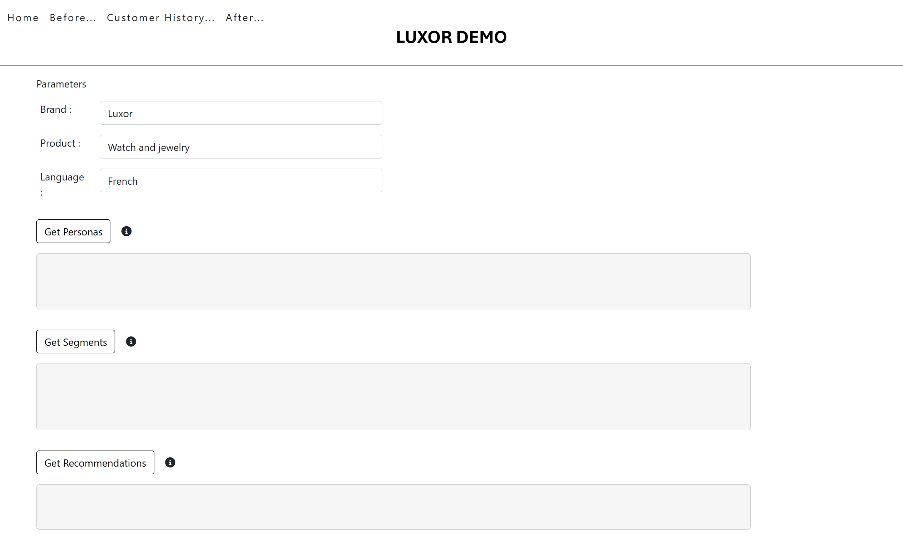
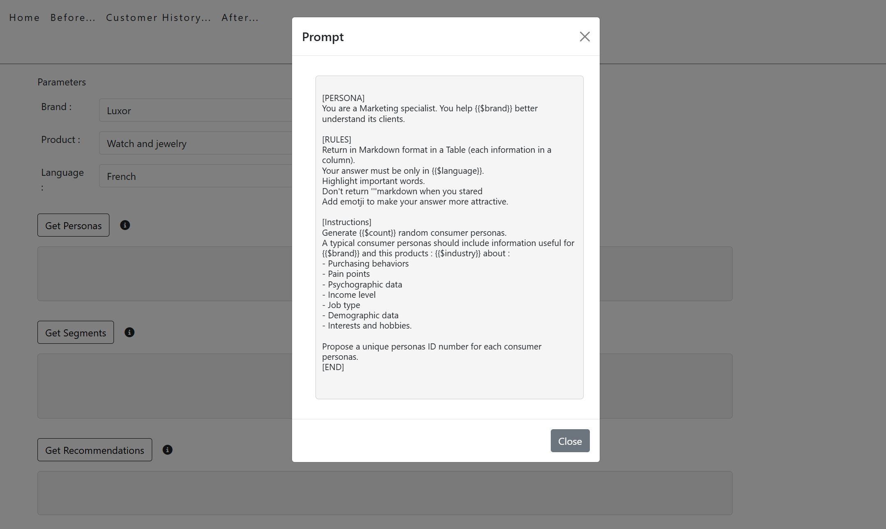
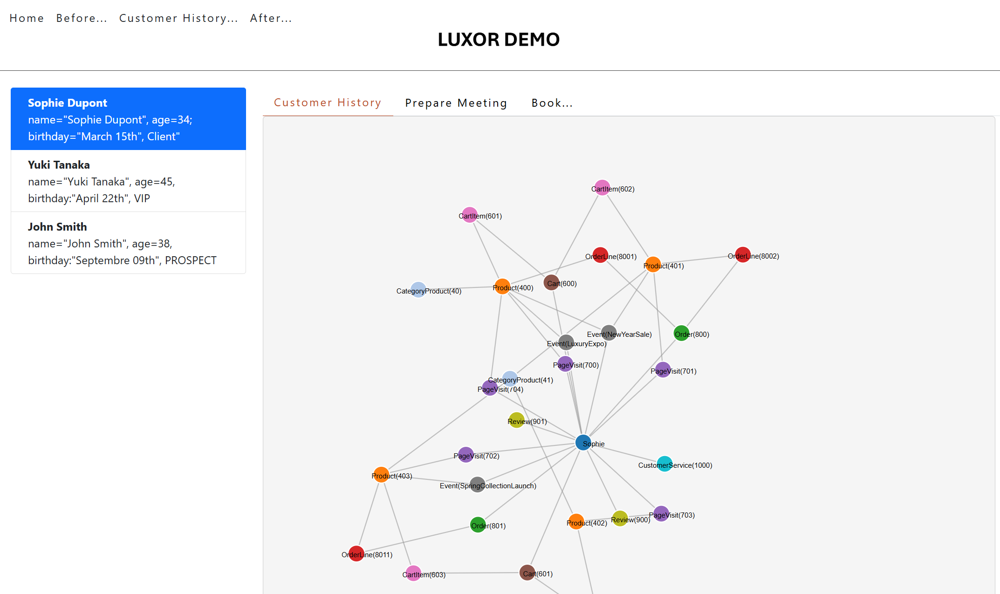
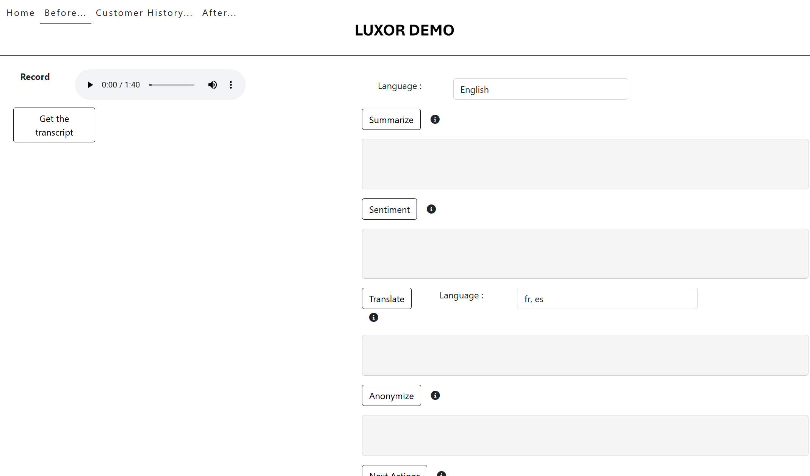
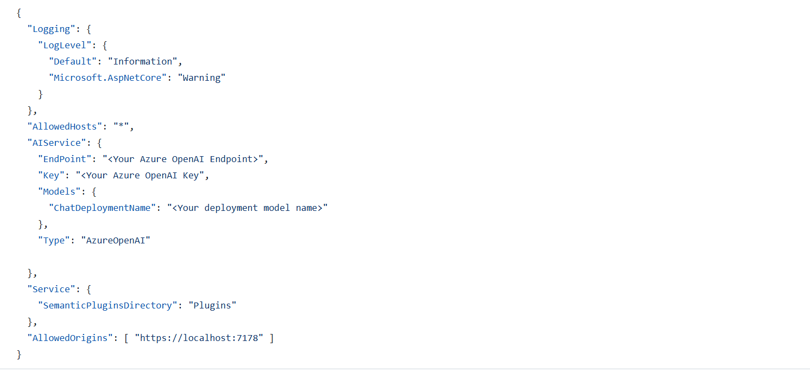

# CustomerJourneyGenAI
Application Demo using Semantic Kernel and LLM : Marketing, Recommandation and Customer Service use cases

## Demo 1 : Marketing

- First, click on "Get Personas" :  GenAI create 5 (by default) personas based on the Brand and product you choose. You can specicy the response language.

- When finish, click on "Get Segments" : GenAI clusters the 5 personas into 3 communcations segments.

- And than, click on "Get Recommendations" to get a product recommandation for each segments.

You can see prompt used by GenAI to generate response by clickin on the "i" button : 

## Demo 2 : Customer History

In this Demo you can show client history for 3 differents type of customer : Prospect, CLient and VIP (or VIC).
Than you will see all interaction between the customer and the Brand (Card, purchase, pages viewed, feedback, customer service, ...)

In the "Prepare meeting" tab, you can generate all informatiln the advisor needs to know about this customer (Products Recommendations, interest in new futur collection, ton rthe advisor can use, warning about customer service and so one).

And, in the last tab "Book", you can generate un book that represente the historical relation between brand and customer. For each purchase, a new chapitre of the book will be create. And the end of the year, the brand can send to the customer all the book, and why not, a physical book where customer is the hero.
The language is the same that it was set on the "prepare meeting" tab.

## Demo 3 : Customer Service

In this demo you can listen un audio file from a call center (discussin between customer and customer service)

- First, click on the "Get Transcript" button to generate the transcript of this audio (in this demo, transcript is hardcoding not real generated).

- Now you can use the other features, like summarize, sentiments analysis etc. Don't forget to first create the summary (the text behond is use for some other features, like translate).

## Use it Locally

to use this demo locally, you need and Azure OpenAI service and set the endpoint, key and model name in the appsettings.json file in the API project.

1. Start the API project "CustomerJourney_API"
2. Than start the Web project "CustomerJourneyGenAI_Web"